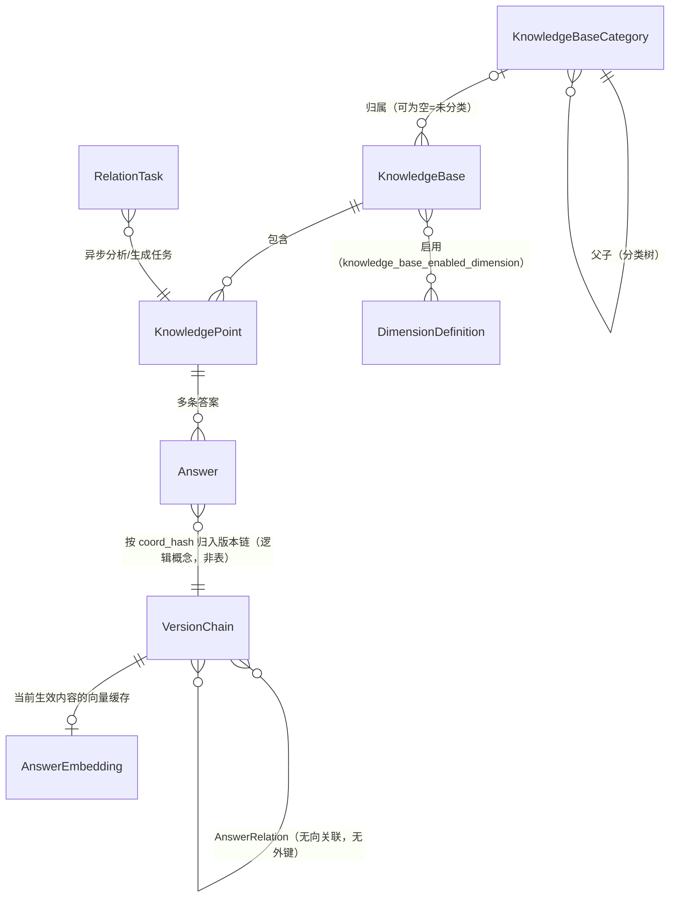

# 对象关系说明

> 梳理本项目核心业务对象及其关系，依据 `backend/src/kb_backend/models/` 与 `docs/PRD.md`、`docs/PRD-答案关联.md`。
> 整理日期：2026-08-20。

## 一图总览

## 层级主线：分类 → 知识库 → 知识点 → 答案 → 版本链

### 1. 知识库分类 `knowledge_base_category`

- 自引用树：`parent_id = NULL` 为顶级分类；「全部」「未分类」是前端虚拟节点，不落库。
- 同级排序由 `sort_order` 承载；删除为**物理删除**（分类无留痕诉求），且 DB 层 RESTRICT 兜底「仅允许删除空分类」（有子分类、或有知识库挂靠的分类都删不掉）。

### 2. 知识库 `knowledge_base`

- 顶层业务容器，`name` 全局唯一，状态 `active / deprecated`（停用而非删除）。
- 可选归属一个分类（`category_id`，NULL = 未分类）。
- 与维度是多对多：通过 `knowledge_base_enabled_dimension` 决定本库启用哪些维度。

### 3. 维度 `dimension_definition`

- **全局字典**，不属于任何一个知识库；主键是字符串 `key`，另有 `label`、`field_type`（text/number/date/boolean）、`default_value`、状态 `active / deprecated`。
- `weight`（1–100）：查询未精确命中时参与「权重回退」排序（见下文匹配规则）。
- `knowledge_base_enabled_dimension`（kb_id + dimension_key 联合主键）是纯关联表：某库启用某维度后，该库的答案才能在条件组合里使用这个维度。

### 4. 知识点 `knowledge_point`

- 属于且仅属于一个知识库；同库内 `title` 唯一（`uq_kp_kb_title`）。
- 软删除：`status = active / deleted` + `deleted_at` / `delete_reason`，留痕永久可查。
- 知识点本身不带内容——内容全部在答案上。

### 5. 答案 `answer` 与版本链（核心概念）

- 一个知识点下可以有**多条答案并存、互不覆盖**，靠「条件组合」区分：
  - **条件组合 `coord`**：本条答案写明的维度取值集合（JSON），如 `{}`（默认答案）、`{租户: 示例租户B}`。取值只能用所在知识库已启用的维度。
  - **`coord_hash`**：coord 的规范化哈希，作为版本链的标识。
- **版本链**（逻辑概念，无独立表）：同一知识点 + 同一 coord_hash 的答案按 `effective_time` 排成一条链。**只增不改**——编辑 = 链尾追加新版本，历史版本永久只读。
- 条件组合变更 = 迁移：原链**整链撤回**（记原因），新条件下新建一条链。
- **撤回/恢复是链级操作**：`revoked` 及 revoke/reactivate 三件套字段由同一条链的所有版本共享语义；撤回后该条件下查询不再返回结果，但历史与留痕永久可查。
- 复合外键 `(knowledge_point_id, knowledge_base_id)` 指向知识点，保证答案与知识点必属同一个库。

**查询解析规则**（给定时间点 + 维度条件）：先精确匹配 coord；未命中时在「条件兼容」的答案里按 **条件更具体 → 涉及维度权重总和更高 → 版本更新** 的顺序回退，选出最匹配的一条；时间维度取 `effective_time ≤ 查询时间` 的最新版本。

## 答案关联（横向关系，跨知识点/跨库）

关联的**端点是版本链**，即 `(knowledge_point_id, coord_hash)`，不是某条具体 answer 行。三张表**刻意不建外键**：对端知识点被软删、链被整链撤回时，关联记录必须保留并在展示层灰态标记（"历史永久可查"口径）。

| 表 | 作用 |
|---|---|
| `answer_relation` | 两条版本链之间的一条**无向**关联；端点排序规范化（a ≤ b）+ 唯一约束保证同一对只有一条。`source = ai / manual`，manual 的不会被后续 AI 分析覆盖。`answer_*_id` / `content_hash_*` 只是生成描述时采用版本的快照（审计用，不 JOIN）；stale = 任一端 content_hash 与该链当前生效版本不一致（查询时动态推导） |
| `answer_embedding` | 每条版本链**当前生效内容**的向量缓存，`(knowledge_point_id, coord_hash)` 唯一；content_hash 或 embedding model 变了就在下次分析时增量重算 |
| `relation_task` | 异步任务队列（MySQL 即队列，worker 乐观 UPDATE 认领）：`analyze`（以某知识点/某链为中心做自动关联）、`generate_pair`（为已有关联生成描述） |

## 用户 `users`（与业务对象正交）

- 由统一身份平台 SSO 下发，首次登录自动建行、不存密码；`identity_* / platform_* / org_*` 为平台快照，每次登录刷新。
- 本系统授权 `role`（none / viewer / editor / admin / sysadmin）只由用户管理页人工授予（例外：平台 super_admin 自动 sysadmin）。用户与知识库之间**没有**逐库授权关系，权限是全局角色制。

## 一句话总结

**知识库**（可挂在**分类树**上）是容器，决定启用哪些**维度**；**知识点**属于知识库，是"问题"；**答案**属于知识点，按维度取值的**条件组合**分成互不覆盖的**版本链**，链内按生效时间只增不改；**答案关联**在版本链之间横向连线（AI/人工），配套向量缓存与异步任务表；**用户**是全局角色制，与上述业务树正交。
